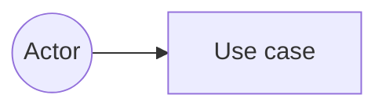

# COMP 3613 Assignment 1

Draft this file with the Guide. Diagrams below must be Mermaid. Link wireframe images from `docs/wireframes/`.

Do not put your student ID in this file if you will commit it. The PDF cover adds your name and ID at export time.

## Assigned project

## Problem interpretation

## Three workflows

### 1.

### 2.

### 3.

## Use case diagram

## Model diagram

First draft. Update this section in Phase 5 and note what changed.

## Wireframes

## Implementation notes

## Deployed app

Public Render URL (not localhost). Markers open this to mark the three workflows.

https://

## Logins

Every account a marker needs, including extra users you added. Starter accounts:

- bob / bobpass — regular user
- admin / adminpass — admin

## YouTube URL

## Competency (student-judge)

Filled when the report is built. Guide runs student-judge, writes `docs/judge.md`, and export appends the scorecard here.

## Skill integrity

Filled by `python manage.py report`. Do not edit the course skills.
